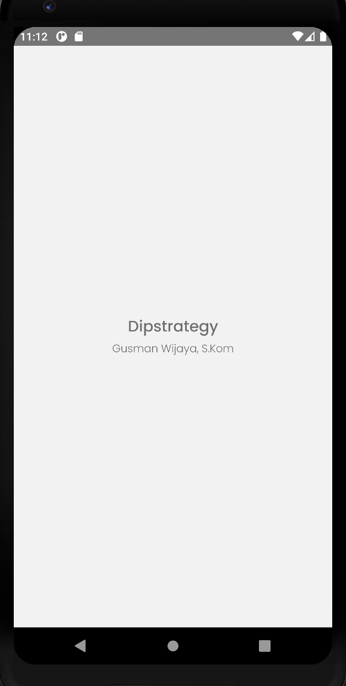
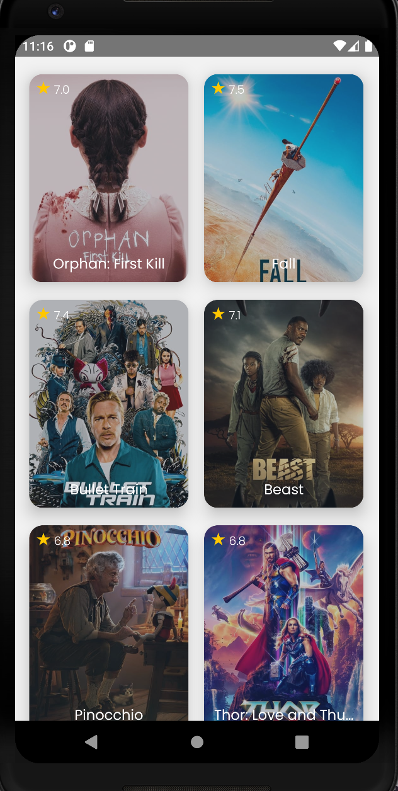
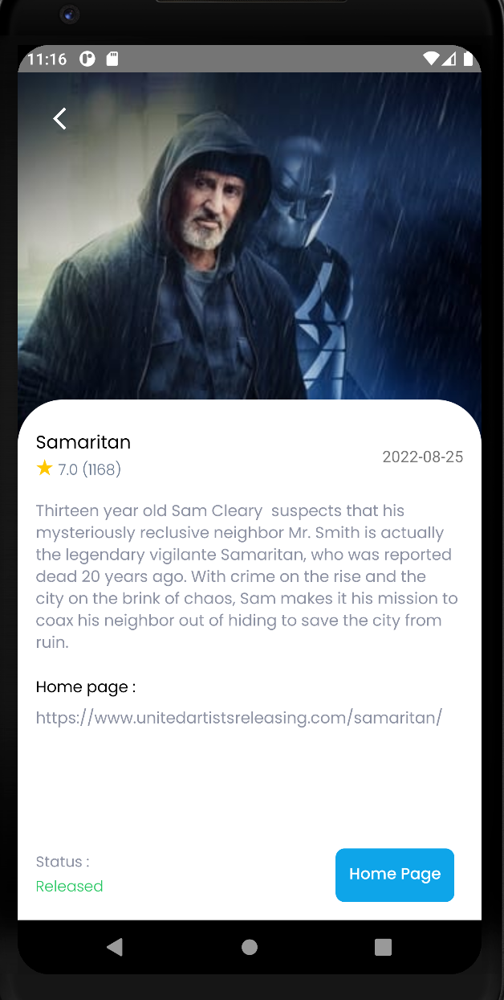
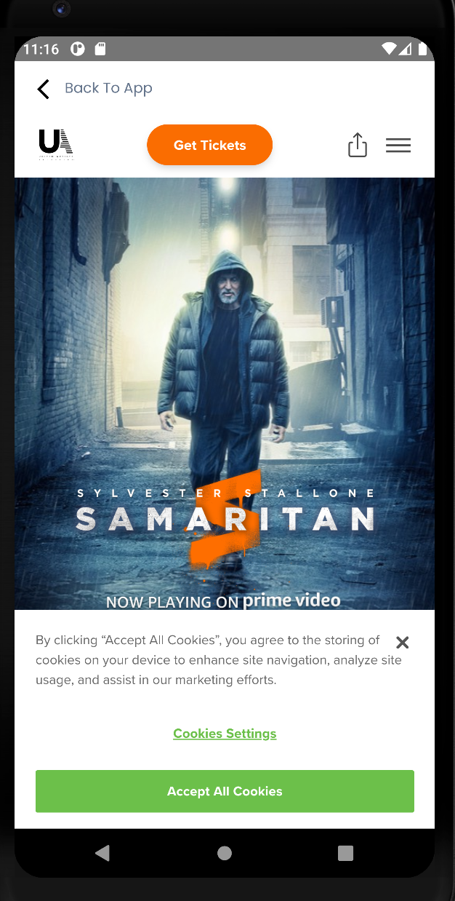

## Screenshots

#### Splash Screen



#### Movies Screen



#### Detail Movie Screen



#### WebView Home Page Screen



## Clone & Install Instructions (Nodejs v16.17.1 and React Native v0.70.1)

```bash
git clone https://github.com/gusmanwijaya/test-dipstrategy.git dipstrategy
cd dipstrategy
npm install || yarn install
```

## Before Run

- Create an api key in [themoviedb](https://www.themoviedb.org/)
- Create file .env at root folder:
-     REACT_APP_API_KEY =
-     REACT_APP_API_HOST =
-     REACT_APP_API_IMAGE =
- Link assets to app:

```bash
npx react-native-asset
npx pod install
```

### Run on Android

```bash
npx react-native start
npx react-native run-android
```

### Run on iOS

```bash
npx react-native start
npx react-native run-ios
```

### Developer

Gusman Wijaya, S.Kom
